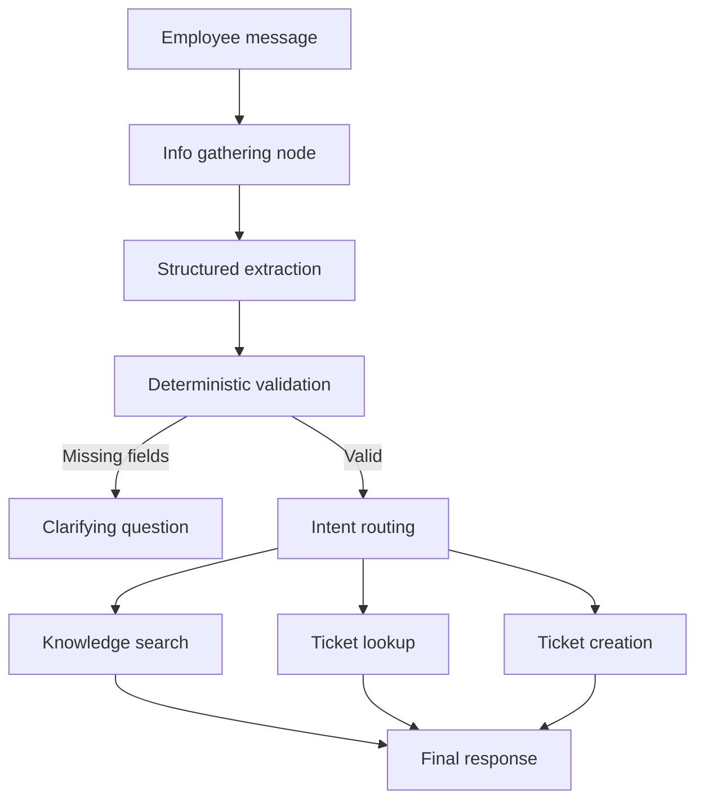

# AI Operations Assistant

Capstone Project 3: An agentic IT support assistant for a fictional organization. The assistant understands an employee request, selects one local tool, executes it through a LangGraph workflow, and returns a grounded response.

## Architecture



The graph state carries conversation history, structured request facts, selected tool, tool calls, and the tool result. Only the structured facts are passed downstream after compaction. LiteLLM native function calling extracts the structured request before LangGraph routes it to the local tool.

The information-gathering node preserves the turn for structured extraction;
it does not make a second LLM completeness decision. Deterministic validation
checks required fields after extraction and before any tool call. Shared
policies such as priorities, ticket statuses, search limits, and extraction
patterns are centralized in `config.py` for reuse.
## Tools

1. `search_knowledge_base`: searches local IT articles in SQLite.
2. `lookup_ticket`: retrieves an existing ticket by ID or by employee plus issue description.
3. `create_ticket`: validates the employee, prevents an identical open duplicate, and creates a new ticket.

## Setup

Requires Python 3.11+.

```powershell
python -m venv .venv
.venv\\Scripts\\Activate.ps1
pip install -r requirements.txt
Copy-Item .env.example .env
python -m db.init_db
streamlit run streamlit_app.py
```

Set `OPENAI_API_KEY` in `.env`. `LLM_MODEL` defaults to `gpt-4o-mini`; LiteLLM can target another compatible provider. `DB_PATH` defaults to `data/support.db`.

The Streamlit workflow uses the configured LLM for structured request
extraction. The bundled tool and graph tests do not require an API key and
provide a quick installation check before starting Streamlit.

## Sample output artifacts

A packaged sample-output bundle is included in `output/sample_results/` for
review and submission. It contains:

- `knowledge_search_example.json`: real-run KB-001 response and tool result
- `ticket_lookup_example.json`: real-run TKT-1001 lookup and response
- `ticket_creation_example.json`: real-run creation plus duplicate prevention
- `submission_summary.md`: artifact description and 41-test verification

The top-level `output/submission_summary.md` provides the same submission
summary for evaluators browsing the output folder.

The runnable sample input data is in `db/seed_data.sql` and contains employees,
knowledge articles, and existing tickets. The database is created automatically
on first use; run `python -m db.init_db` when you want to reset it to the
packaged sample state.

## Sample requests

The complete replayable scenario catalogue is documented in
[output/conversation.md](output/conversation.md). It covers positive,
negative, and boundary cases for knowledge search, ticket lookup, and ticket
creation. These are demonstration conversations; automated regression tests
are under `tests/`.

- `How do I reset my VPN password?`
- `I am EMP1024. What is the status of ticket TKT-1001?`
- `I am EMP1024. What is the status of my VPN issue?`
- `I am EMP3072 and my laptop will not connect to Wi-Fi. Please create a ticket.`

Example outputs:

- Knowledge search returns the `KB-001` VPN reset article and its source.
- Issue-based lookup returns `TKT-1001` with `in_progress` status.
- Ticket creation returns a generated `TKT-XXXXXXXX` ID; repeating the same request reports the existing duplicate instead of creating another ticket.

The Streamlit sidebar exposes the session ID, a new-session action, structured extraction, and the tool-call trace for demonstration.

## Project structure

- `pipeline/`: LangGraph state, prompts, routing, and tool orchestration
- `tools/`: the three SQLite-backed IT support tools (`support_tools.py`)
- `db/`: SQLite schema, seed data, and connection helpers
- `session/`: in-memory multi-turn conversation state
- `views/`: Streamlit chat UI
- `llm/`: LiteLLM JSON response wrapper

## Error handling and safety

The assistant asks for missing employee IDs or issue details before acting. Ticket creation rejects unknown employees, invalid priorities, and identical open duplicates. Tool results are recorded and final responses distinguish missing data, existing tickets, newly created tickets, and temporary tool failures. LLM, database, and graph exceptions are logged and converted into user-facing recovery messages. The local database is sample data for a POC and is not production persistence or access control.

## Tests

Run the local regression checks with:

```powershell
python -m unittest discover -s tests -v
```

This command runs without `OPENAI_API_KEY` because it exercises local tools
and mocks only structured extraction. The latest run completed 41 tests
successfully. The interactive application requires a valid key in `.env`.

## Limitations

Session state is in memory and is lost when the process restarts. Knowledge search uses SQLite keyword matching rather than embeddings. A production system would add authentication, durable storage, audit logging, retries, and stronger search/reranking.
